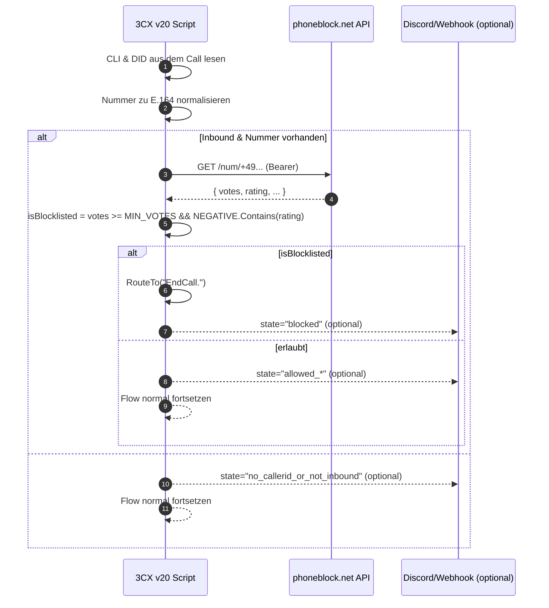

# Phoneblock für 3CX v20

Prüft eingehende Anrufe in 3CX v20 gegen die [phoneblock.net](https://phoneblock.net)-API und blockiert Spam automatisch. Optional werden Ereignisse per **Discord**- oder **Generic JSON Webhook** gemeldet.

---

## ✨ Features

- ✅ E.164-Normalisierung eingehender CLI (z. B. `+49123456789`)
- ✅ Lookup bei [phoneblock.net](https://phoneblock.net) mit Bearer-Token (siehe auch Projekt [PhoneBlock](https://github.com/haumacher/phoneblock))
- ✅ Blockiert Anrufe ab konfigurierbarem Mindest-Stimmenwert und negativer Bewertung
- ✅ Optionale Benachrichtigung per Discord-Webhook und generischem JSON-Webhook
- ✅ Konservatives HTTP-Timeout, defensives Logging, kein Leaken von Secrets

---

## 🧠 Funktionsweise



---

## 📦 Voraussetzungen

- **3CX v20** mit **Scripting** (Klasse basiert auf `ScriptBase<T>`)
- .NET-fähige Umgebung gemäß 3CX-Scripting
- Internetzugriff von der PBX zur `phoneblock.net`-API und ggf. zu Webhook-Zielen

---

## 🔧 Installation & Deployment (3CX v20)

1. **Neues Script anlegen**  
   In der 3CX-Verwaltung (v20) den Bereich **Scripting** öffnen → **Neues Script** (C# / `ScriptBase<T>`).

2. **Code einfügen**  
   Die Klasse aus `BlockSpamViaPhoneBlock.cs` (siehe Repository) in den Editor kopieren.  
   Namespace/Typ **nicht** umbenennen:
   ```csharp
   namespace phoneblock_block
   {
       public class BlockSpamViaPhoneBlock : ScriptBase<BlockSpamViaPhoneBlock>
       { /* … */ }
   }
   ```

3. **Konstanten konfigurieren** (siehe nächster Abschnitt).

4. **Kompilieren/Speichern**  
   Fehlerfrei bauen. Logs prüfen.

5. **Einbinden in den Call-Flow**  
   Das Script vor/an den Anfang der gewünschten eingehenden Route/IVR hängen.  
   - Gibt das Script `true` zurück, wurde bereits nach **EndCall** geroutet (Call beendet).  
   - Gibt es `false` zurück, läuft der bestehende Flow unverändert weiter.

> ⚠️ Die genaue UI-Bezeichnung kann je nach 3CX-Build leicht variieren. Wichtig ist, dass das Script für **Inbound Calls** frühzeitig ausgeführt wird.

---

## ⚙️ Konfiguration

Im Code sind gut sichtbare Konstanten hinterlegt:

```csharp
const string API_BASE = "https://phoneblock.net/phoneblock/api";
const string BEARER   = "<PHONEBLOCK_API_TOKEN>"; // <-- ersetzen
const int    MIN_VOTES = 4;

const string DISCORD_WEBHOOK = "";   // optional
const string GENERIC_WEBHOOK = "";   // optional
const int    HTTP_TIMEOUT_SEC = 6;

static readonly HashSet<string> NEGATIVE = new(StringComparer.OrdinalIgnoreCase)
{ "C_PING","D_POLL","E_ADVERTISING","F_GAMBLE","G_FRAUD" };
```

- **BEARER**: Dein phoneblock.net-Bearer-Token (Pflicht).  
- **MIN_VOTES**: Mindestanzahl an Stimmen, ab der blockiert wird.  
- **NEGATIVE**: Bewertungs-Codes, die als negativ gelten.  
- **DISCORD_WEBHOOK / GENERIC_WEBHOOK**: Leer lassen, wenn nicht genutzt.  
- **HTTP_TIMEOUT_SEC**: Timeout für API/Webhooks in Sekunden.

### Bewertungs-Codes (Voreinstellung)

| Code           | Bedeutung          |
|----------------|--------------------|
| `B_MISSED`     | Unbekannt          |
| `C_PING`       | Ping-Call          |
| `D_POLL`       | Umfrage            |
| `E_ADVERTISING`| Werbung            |
| `F_GAMBLE`     | Glücksspiel        |
| `G_FRAUD`      | Betrug             |

Passe die Liste nach Bedarf an.

---

## 🔒 Datenschutz & Sicherheit

- API-Token und Webhook-URLs sind **nicht** im Log sichtbar.  
- Es werden ausschließlich **Metadaten** (Nummer, Votes, Rating, DID, Timestamp) verarbeitet.  
- Lege Secrets **nicht** dauerhaft im Code ab (Alternative: 3CX-Config/Umgebungsvariablen, falls verfügbar).

---

## 📝 Beispiel-Payloads der Webhooks

### Discord (mit Embed)

```json
{
  "username": "3CX PhoneBlock",
  "content": "**PhoneBlock** `blocked`\n• Nummer: `+49123456789`\n• Votes: `7`\n• Rating: `G_FRAUD`\n• DID: `+4959123456`\n• TS: `2025-01-01T12:34:56.789Z`",
  "embeds": [{
    "title": "BLOCKED",
    "color": 16711680,
    "fields": [
      {"name":"Nummer","value":"`+49123456789`","inline":true},
      {"name":"Votes","value":"`7`","inline":true},
      {"name":"Rating","value":"`G_FRAUD`","inline":true},
      {"name":"DID","value":"`+4959123456`","inline":true},
      {"name":"TS","value":"`2025-01-01T12:34:56.789Z`","inline":false}
    ]
  }]
}
```

> Fallback ohne Embed wird bei HTTP 400 automatisch versucht.

### Generic JSON Webhook

```json
{
  "state": "allowed_listed",
  "number": "+49123456789",
  "votes": 2,
  "rating": "E_ADVERTISING",
  "did": "+4959123456",
  "ts": "2025-01-01T12:34:56.789Z"
}
```

## 📄 Logging

Typische Log-Einträge (gekürzt):

```
PhoneBlock START cli=01234 did=+4959123456 e164=+491234
PhoneBlock BLOCK +491234 rating=G_FRAUD votes=7
PhoneBlock Discord webhook OK (204).
```

Bei Fehlern:

```
PhoneBlock LOOKUP_FAIL +491234 body={...}
PhoneBlock generic webhook FAIL 500 InternalServerError: ...
PhoneBlock exception: ...
```

---

## ❓ FAQ

**Blockiert das Script auch Anrufe ohne Nummer?**  
Nein. Es setzt dann den Flow normal fort und kann optional benachrichtigen (`state="no_callerid_or_not_inbound"`).

**Was passiert, wenn die API nicht erreichbar ist?**  
Der Anruf wird **nicht** blockiert; der Flow geht weiter. Optional erfolgt eine Benachrichtigung (`lookup_failed`).

---

## 🤝 Beitrag & Support

Issues und PRs sind willkommen. Bitte bei Bugs reproduzierbare Schritte, Logs (ohne Secrets) und 3CX-Build angeben.

---

## ⚠️ Disclaimer

Dieses Script wird ohne Gewähr bereitgestellt. Prüfe die rechtlichen Rahmenbedingungen (Rufnummern-Blockierung, Datenschutz) in deinem Land und deiner Umgebung.

---

## 📌 Kurzfassung (TL;DR)

- Token eintragen → MIN_VOTES/NEGATIVE setzen → Script kompilieren → vor Inbound-Flow hängen.  
- Bei genügend negativen Votes: **Call endet**. Andernfalls läuft alles normal weiter.  
- Optional: Discord/Generic Webhooks für Benachrichtigungen aktivieren.
